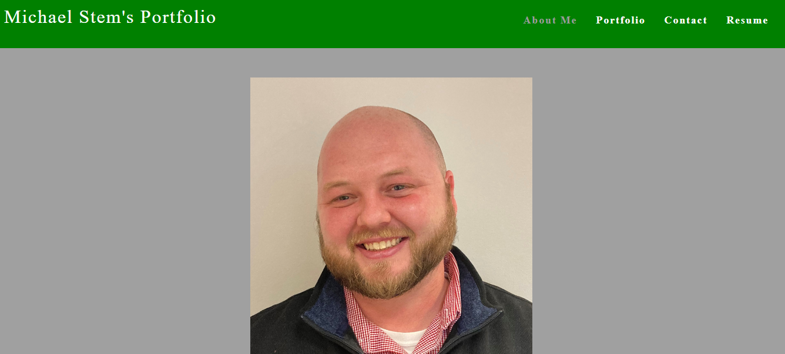
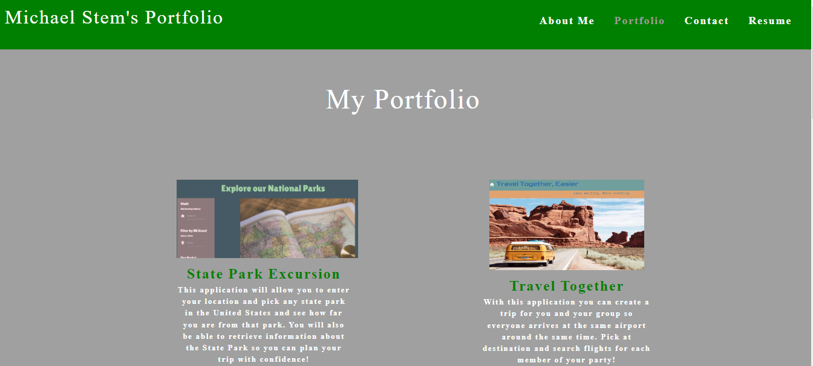
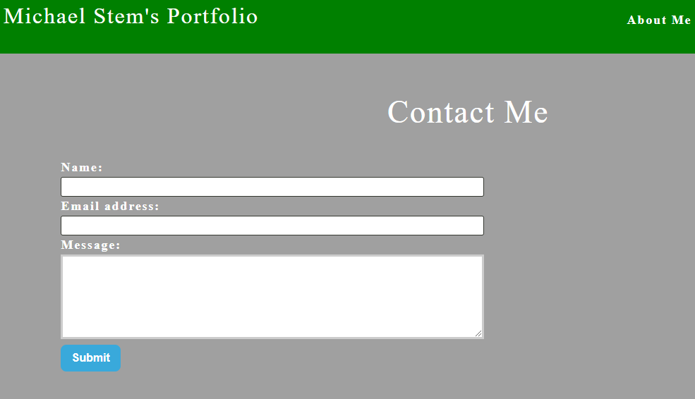
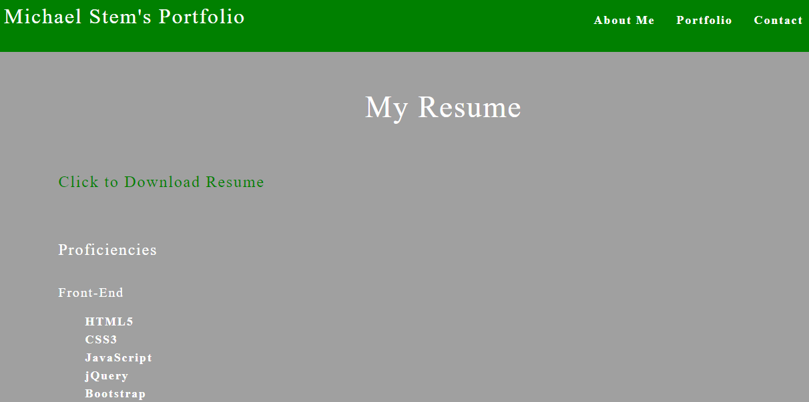

# Fancy_Tech_Blog

## Table-of-Contents

  * [Description](#description)
  * [Installation](#installation)
  * [Usage](#usage)
  * [License](#license)
  * [Contributing](#contributing)
  * [Links](#Links)
  
## [Description](#table-of-contents)
This portfolio was created to show my previous work and was built with React.js. You will land on the About Me section with a photo and short bio. There are links to the Portfolio section, Contact section and Resume Section in the navigation bar. The Portfolio section has 6 previous works with a link to the application and the github repository. The Contact section allows you to enter your name, email address and a message with a submit button. The Resume section has a link to download my resume as well as a list of proficiencies. 

## [Installation](#table-of-contents)
Visit the deployed application.

## [Usage](#table-of-contents)

  

  

  

  
  
## [license](#table-of-contents)
MIT License

## [Contributing](#table-of-contents)
Contributions will not be accepted at this time.

## [Links](#table-of-contents)

[GitHub](https://github.com/mikestem)

[Deployed Link](https://mikestem.github.io/Portfolio_Michael_Stem/)